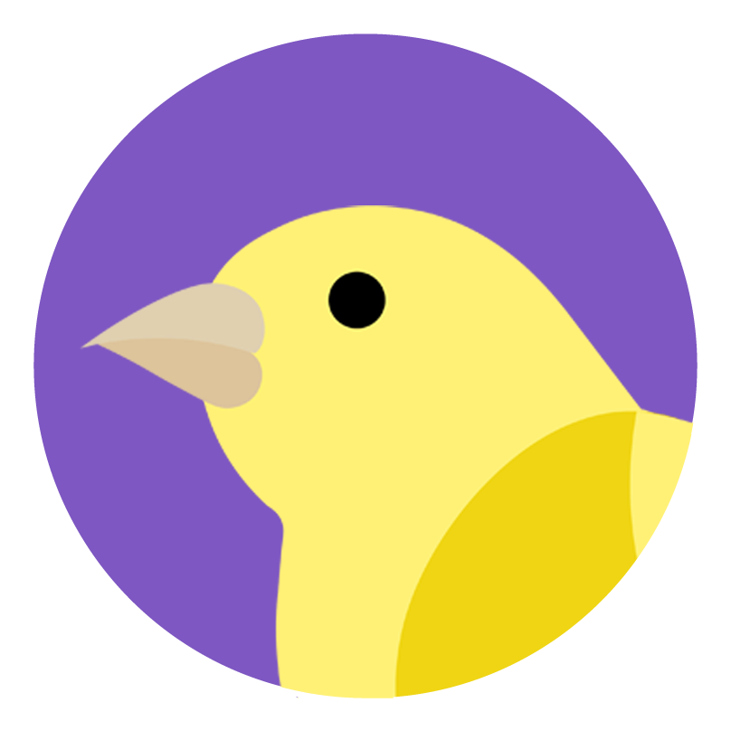

<p align="center">
  
</p>
<h1 align="center">
  Canary
</h1>

<p align="center">
  <a href="https://github.com/henry-ns/portfolio/graphs/commit-activity" alt="Maintenance">
    
  </a>
  <a href="./LICENSE" alt="License: MIT">
    
  </a>
  <a href="https://www.codefactor.io/repository/github/henry-ns/canary" alt="CodeFactor">
    
  </a>
</p>

## :clipboard: Description
Canary is a system for monitoring air quality information through the device that can capture aspects such as air temperature, air humidity and concentration of some gases (currently CO, CO2 and NH3) in the ambient.

this project was created to compete on the [7th Campus Mobile](https://www.institutonetclaroembratel.org.br/nossas-novidades/programa-campus-mobile-anuncia-os-finalistas-da-7a-edicao/) and we achieved to be one of the finalists in the smart cities category as "*Projeto Desenvolvendo um dispositivo de monitoramento da qualidade do ar conectado a smartphones"*.

## :rocket: Getting Started
1.	**Download the repository**
  ```sh
    git clone https://github.com/henry-ns/canary.git
  ```

2.  **Installation process**

Use Yarn ou NPM for install all dependencies for the server and the mobile app. Inside the current folder (server or mobile) execute the follows commands:
```
  yarn
  yarn start
```
or
```
  npm install
  npm start
```

For the hardware, you need to have a `NodeMCU` for instalation inside it. Considering you have this:
1. Download the [Arduino IDE](https://www.arduino.cc/en/main/software)
2. [Install ESP8266 board](https://www.teachmemicro.com/intro-nodemcu-arduino/)
3. Install all dependencies:
   - ESP8266HTTPUpdateServer
   - ESP8266WebServer
   - ESP8266WiFi
   - WiFiClient
   - DHT
4. Update the hardware with the code.

## 🧐 What's inside?

### Technologies
  - [Arduino](https://www.arduino.cc/): for programing the embedded system
  - [React Native](https://facebook.github.io/react-native/): for mobile app
  - [Node.js](https://nodejs.org/en/): for server
  - [NodeMCU](https://en.wikipedia.org/wiki/NodeMCU): the embedded system
  - [PostgreSQL](https://www.postgresql.org/): for database

## Packages on mobile
  - [Axios](https://github.com/axios/axios)
  - [React Native Material Dropdown](https://github.com/n4kz/react-native-material-dropdown)
  - [React Native Orientation](https://github.com/yamill/react-native-orientation)
  - [React Native Picker Select](https://github.com/lawnstarter/react-native-picker-select)
  - [React Native Smart Button](https://www.npmjs.com/package/react-native-smart-button)
  - [React Native Vector Icons](https://github.com/oblador/react-native-vector-icons)
  - [React Navigation](https://reactnavigation.org/)

## Packages on server
  - [Bcrypt](https://www.npmjs.com/package/bcrypt-nodejs)
  - [Consign](https://www.npmjs.com/package/consign)
  - [Express](https://expressjs.com/)
  - [JWT Simple](https://www.npmjs.com/package/jwt-simple)
  - [Knex](http://knexjs.org/)
  - [Passport](http://www.passportjs.org/)
  - [Nodemon](https://nodemon.io/)
